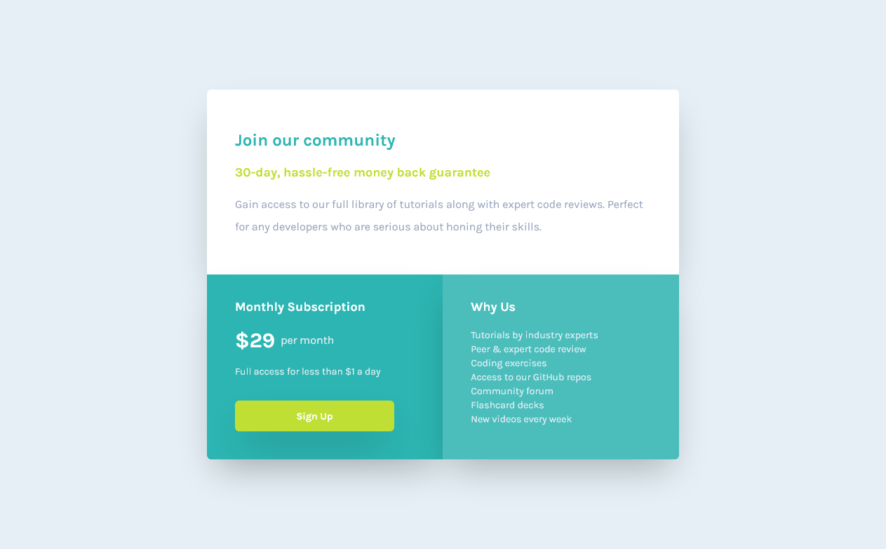

# Frontend Mentor - Single price grid component solution

This is a solution to the [Single price grid component challenge on Frontend Mentor](https://www.frontendmentor.io/challenges/single-price-grid-component-5ce41129d0ff452fec5abbbc). 

## Table of contents

- [Overview](#overview)
  - [The challenge](#the-challenge)
  - [Screenshot](#screenshot)
  - [Links](#links)
- [My process](#my-process)
  - [Built with](#built-with)
  - [What I learned](#what-i-learned)
  - [Continued development](#continued-development)
  - [Useful resources](#useful-resources)
- [Author](#author)
- [Acknowledgments](#acknowledgments)

## Overview

### The challenge

Users should be able to:

- View the optimal layout for the component depending on their device's screen size
- See a hover state on desktop for the Sign Up call-to-action

### Screenshot




### Links

- Solution URL: [Add solution URL here](https://your-solution-url.com)
- Live Site URL: [Add live site URL here](https://your-live-site-url.com)

## My process

### Built with

- Semantic HTML5 markup
- TailwindCSS
- Flexbox
- CSS Grid
- Mobile-first workflow
- [TailwindCSS](https://tailwindcss.com/) - CSS Framework
- [ViteJS](https://vitejs.dev/) - Next Generation Frontend Tooling

### What I learned


To add TailwindCSS to Vite project the following [guide](https://tailwindcss.com/docs/guides/vue-3-vite):
In main.js:
```js
import './style.css';
import "tailwindcss/tailwind.css";
```
```html
  <body class="bg-myLightGray flex justify-center items-center">
    <script type="module" src="/main.js"></script>
  </body>
```
To extend TailwindCSS defaults with additional fonts and customized colors:
```js
module.exports = {
  purge: [],
  darkMode: false, // or 'media' or 'class'
  theme: {
    extend: {
      fontFamily: {
        "karla": ["karla"], //url of Google fonts added to <head> in index.html
      },
      colors: {
        "myCyan": "hsl(179, 62%, 43%)",
        "myBrightYellow": "hsl(71, 73%, 54%)",
        "myLightGray": "hsl(204, 43%, 93%)",
        "myGrayishBlue": "hsl(218, 22%, 67%)",
        "myGreenLight": "hsla(179,47%, 52%, 1)",
        "myGreenDark": "hsla(179,61%, 44%, 1)",
      },
    },
  },
  variants: {
    extend: {},
  },
  plugins: [],
}
```

### Continued development

In this project I have applied more concepts of TailwindCSS. However this makes easy because of previous background in CSS basics.

### Useful resources

- [TailwindCSS Directives](https://tailwindcss.com/docs/functions-and-directives) - Use of @apply directive
- [Customizing Colors in TailwindCSS](https://tailwindcss.com/docs/customizing-colors) - Adding personalized color names to be used in tailwindcss.

## Author

- Website - [Add your name here](https://www.your-site.com)
- Frontend Mentor - [@yourusername](https://www.frontendmentor.io/profile/yourusername)
- Twitter - [@yourusername](https://www.twitter.com/yourusername)

**Note: Delete this note and add/remove/edit lines above based on what links you'd like to share.**

## Acknowledgments

This is where you can give a hat tip to anyone who helped you out on this project. Perhaps you worked in a team or got some inspiration from someone else's solution. This is the perfect place to give them some credit.

## Author

- Website - [Gustavo Sanchez](https://www.gusanche.dev)
- Frontend Mentor - [@gusanchedev](https://www.frontendmentor.io/profile/gusanchedev)
- Github - [@gusanchedev](https://www.github.com/gusanchedev)
- Twitter - [@gusanchedev](https://www.twitter.com/gusanchedev)
- Linkedin - [gusanchedev](https://www.linkedin.com/in/gusanchedev/)

## Acknowledgments

Thanks to Mariapaz for being my friend and support 💙